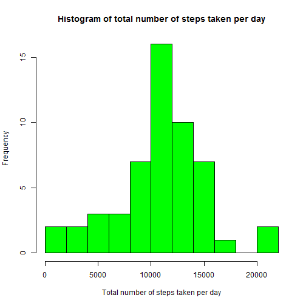
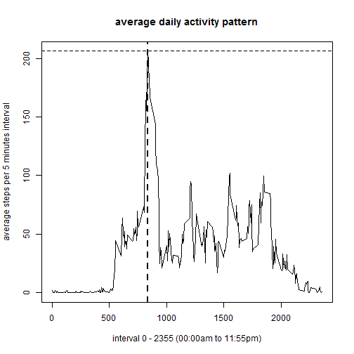
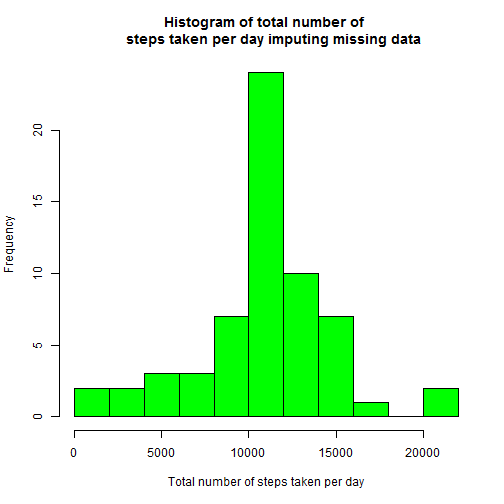
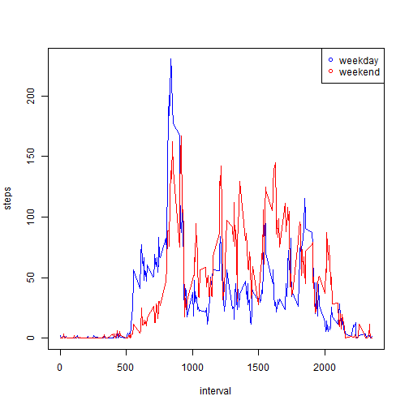

## Loading and preprocessing the data

The missing values in the datase are ignored


```r
activitydata <- read.csv("data/activity.csv", colClasses = c("numeric", "character", "numeric"))
notnatotalstepsperday <- activitydata[!is.na(activitydata$steps),]
totalstepsperday <- aggregate(x=notnatotalstepsperday["steps"], by=list(date=notnatotalstepsperday$date), sum)
hist(totalstepsperday$steps, col = "green", breaks = 10, main = 
    "Histogram of total number of steps taken per day", xlab = "Total number of steps taken per day")
```



## What is mean total number of steps taken per day?

The mean and median total number of steps taken per day are calculated.


```r
mean(totalstepsperday$steps)
```

```
## [1] 10766.19
```

```r
median(totalstepsperday$steps)
```

```
## [1] 10765
```

The mean total number of steps taken per day is 10766.19 and the median total number of steps taken per day is 10765.


## What is the average daily activity pattern?

A time series plot (i.e. type = "l") of the 5-minute interval (x-axis)
and the average number of steps taken, averaged across all days (y-axis) are calculated  and shown.
The 5-minute interval, on average across all the days in the dataset, contains the maximum number of 
steps, is calculated and indicated by a vertical line.


```r
averagestepsper5minuteinterval <- aggregate(x=notnatotalstepsperday["steps"], 
    by=list(interval=notnatotalstepsperday$interval), mean)
plot(averagestepsper5minuteinterval$interval, averagestepsper5minuteinterval$steps, 
    type = "l", xlab="interval 0 - 2355 (00:00am to 11:55pm)", 
	ylab = "average steps per 5 minutes interval", main = "average daily activity pattern")
averagestepsper5minuteinterval[averagestepsper5minuteinterval$steps==
    max(averagestepsper5minuteinterval$steps),1]
```

```
## [1] 835
```

```r
abline(v=averagestepsper5minuteinterval[averagestepsper5minuteinterval$steps==
    max(averagestepsper5minuteinterval$steps),1], lwd = 2)
```



The 5 minutes interval at 8:35 am contains the maximum number of 
steps on average across all the days in the dataset.

## Imputing missing values

The total number of missing values in the dataset (i.e. the total number of rows with NAs) are calculated. 

The strategy for filling in all of the missing values in the dataset is, that the missing values are filled by the mean
of 5 minute intervals over all days

A histogram of the total number of steps taken each day is shown 
and the mean and median total number of steps taken per day is calculated.


```r
sum(is.na(activitydata$steps))
```

```
## [1] 2304
```

```r
natotalstepsperday <- activitydata[is.na(activitydata$steps),]
for (i in 1:length(natotalstepsperday[,1])) {
	for (j in 1:length(averagestepsper5minuteinterval[,1])) {
		if (averagestepsper5minuteinterval[j,1] == natotalstepsperday[i,3]) {
			natotalstepsperday[i,1] <- averagestepsper5minuteinterval[j,2]
		}
	}
}

activitydata2 <- rbind(notnatotalstepsperday,natotalstepsperday)
totalstepsperday2 <- aggregate(x=activitydata2["steps"], by=list(date=activitydata2$date), sum)
hist(totalstepsperday2$steps, col = "green", breaks = 10, main = "Histogram of total number of 
    steps taken per day", xlab = "Total number of steps taken per day")
```



```r
mean(totalstepsperday2$steps)
```

```
## [1] 10766.19
```

```r
median(totalstepsperday2$steps)
```

```
## [1] 10766.19
```

The total number of missing values in the dataset is 2304.

The impact is, that now there are 8 more days with total daily number of steps.
There are more counts of total steps at the middle of the plot. 

The mean total number of steps taken per day does not differ from the first part of the assignment.
The median total number is little bit higher, closer to the mean. 


## Are there differences in activity patterns between weekdays and weekends?

A new factor variable in the dataset with two levels -- "weekday" and "weekend" is created indicating whether a given date is a weekday or weekend day.

A panel plot containing a time series plot (i.e. type = "l") of the 5-minute interval (x-axis) 
and the average number of steps taken, averaged across all weekday days or weekend days (y-axis) is maked.


```r
fday = factor (c("weekday","weekend"))
weekproperty <- function(day) {
	if (day == "Montag" | day =="Dienstag" | day == "Mittwoch" | day == "Donnerstag" | day == "Freitag") {
		"weekday"
	} else {
		"weekend"
	}
}
activitydata2$fday <- rep(fday[1], each = length(activitydata2$date))

for (i in 1:length(activitydata2[,1])) {
	activitydata2$fday[i] <- factor(weekproperty(weekdays(as.Date(activitydata2$date[i],"%Y-%m-%d"))))
}

averagestepsper5minuteinterval2 <- aggregate(x=activitydata2["steps"], by=list(interval=activitydata2$interval, fday=activitydata2$fday), mean)
with(subset(averagestepsper5minuteinterval2, fday == "weekday"), plot(interval, steps, main = "",
type = "l", col = "blue"))
with(subset(averagestepsper5minuteinterval2, fday == "weekend"), points(interval, steps, main = "",
type = "l", col = "red"))
legend("topright", pch = 1, col = c("blue", "red"), legend = c("weekday", "weekend"))
```



There is a differences in activity patterns between weekdays and weekends. At weekend the activity starts later and
it is not so extreme high in the morning as on weekdays.
